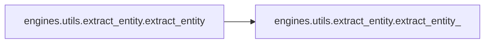

# Engines Utils

[_Documentation generated by Documatic_](https://www.documatic.com)

<!---Documatic-section-Codebase Structure-start--->
## Codebase Structure

<!---Documatic-block-system_architecture-start--->
```mermaid
None
```
<!---Documatic-block-system_architecture-end--->

# #
<!---Documatic-section-Codebase Structure-end--->

<!---Documatic-section-engines.utils.extract_entity.extract_entity_-start--->
## [engines.utils.extract_entity.extract_entity_](3-engines_utils.md#engines.utils.extract_entity.extract_entity_)

<!---Documatic-section-extract_entity_-start--->
<!---Documatic-block-engines.utils.extract_entity.extract_entity_-start--->
<details>
	<summary><code>engines.utils.extract_entity.extract_entity_</code> code snippet</summary>

```python
def extract_entity_(sentence, labels_, reg_str, label_level):
    entices = []
    labeled_labels = []
    labeled_indices = []
    labels__ = ['%03d' % ind + lb for (lb, ind) in zip(labels_, range(len(labels_)))]
    labels = ' '.join(labels__)
    re_entity = re.compile(reg_str)
    m = re_entity.search(labels)
    while m:
        entity_labels = m.group()
        if label_level == 1:
            labeled_labels.append('_')
        elif label_level == 2:
            labeled_labels.append(entity_labels.split()[0][5:])
        start_index = int(entity_labels.split()[0][:3])
        if len(entity_labels.split()) != 1:
            end_index = int(entity_labels.split()[-1][:3]) + 1
        else:
            end_index = start_index + 1
        entity = ' '.join(sentence[start_index:end_index])
        labels = labels__[end_index:]
        labels = ' '.join(labels)
        entices.append(entity)
        labeled_indices.append((start_index, end_index))
        m = re_entity.search(labels)
    return (entices, labeled_labels, labeled_indices)
```
</details>
<!---Documatic-block-engines.utils.extract_entity.extract_entity_-end--->
<!---Documatic-section-extract_entity_-end--->

# #
<!---Documatic-section-engines.utils.extract_entity.extract_entity_-end--->

<!---Documatic-section-engines.utils.extract_entity.extract_entity-start--->
## [engines.utils.extract_entity.extract_entity](3-engines_utils.md#engines.utils.extract_entity.extract_entity)

<!---Documatic-section-extract_entity-start--->


### Object Calls

* [engines.utils.extract_entity.extract_entity_](3-engines_utils.md#engines.utils.extract_entity.extract_entity_)

<!---Documatic-block-engines.utils.extract_entity.extract_entity-start--->
<details>
	<summary><code>engines.utils.extract_entity.extract_entity</code> code snippet</summary>

```python
def extract_entity(x, y, data_manager):
    label_scheme = data_manager.label_scheme
    label_level = data_manager.label_level
    label_hyphen = data_manager.hyphen
    reg_str = ''
    if label_scheme == 'BIO':
        if label_level == 1:
            reg_str = '([0-9][0-9][0-9]B' + ' )([0-9][0-9][0-9]I' + ' )*'
        elif label_level == 2:
            tag_bodies = ['(' + tag + ')' for tag in data_manager.suffix]
            tag_str = '(' + '|'.join(tag_bodies) + ')'
            reg_str = '([0-9][0-9][0-9]B' + label_hyphen + tag_str + ' )([0-9][0-9][0-9]I' + label_hyphen + tag_str + '\\s*)*'
    elif label_scheme == 'BIESO':
        if label_level == 1:
            reg_str = '([0-9][0-9][0-9]B' + ' )([0-9][0-9][0-9]I' + ' )*([0-9][0-9][0-9]E' + ' )|([0-9][0-9][0-9]S' + ' )'
        elif label_level == 2:
            tag_bodies = ['(' + tag + ')' for tag in data_manager.suffix]
            tag_str = '(' + '|'.join(tag_bodies) + ')'
            reg_str = '([0-9][0-9][0-9]B' + label_hyphen + tag_str + ' )([0-9][0-9][0-9]I' + label_hyphen + tag_str + ' )*([0-9][0-9][0-9]E' + label_hyphen + tag_str + ' )|([0-9][0-9][0-9]S' + label_hyphen + tag_str + ' )'
    return extract_entity_(x, y, reg_str, label_level)
```
</details>
<!---Documatic-block-engines.utils.extract_entity.extract_entity-end--->
<!---Documatic-section-extract_entity-end--->

# #
<!---Documatic-section-engines.utils.extract_entity.extract_entity-end--->

<!---Documatic-section-engines.utils.io_functions.read_csv-start--->
## [engines.utils.io_functions.read_csv](3-engines_utils.md#engines.utils.io_functions.read_csv)

<!---Documatic-section-read_csv-start--->
<!---Documatic-block-engines.utils.io_functions.read_csv-start--->
<details>
	<summary><code>engines.utils.io_functions.read_csv</code> code snippet</summary>

```python
def read_csv(file_name, names, delimiter='t'):
    if delimiter == 't':
        sep = '\t'
    elif delimiter == 'b':
        sep = ' '
    else:
        sep = delimiter
    return pd.read_csv(file_name, sep=sep, quoting=csv.QUOTE_NONE, skip_blank_lines=False, header=None, names=names)
```
</details>
<!---Documatic-block-engines.utils.io_functions.read_csv-end--->
<!---Documatic-section-read_csv-end--->

# #
<!---Documatic-section-engines.utils.io_functions.read_csv-end--->

<!---Documatic-section-engines.utils.logger.get_logger-start--->
## [engines.utils.logger.get_logger](3-engines_utils.md#engines.utils.logger.get_logger)

<!---Documatic-section-get_logger-start--->
<!---Documatic-block-engines.utils.logger.get_logger-start--->
<details>
	<summary><code>engines.utils.logger.get_logger</code> code snippet</summary>

```python
def get_logger(log_dir):
    log_file = log_dir + '/' + datetime.datetime.now().strftime('%Y-%m-%d-%H-%M-%S.log')
    logger = logging.getLogger(__name__)
    logger.setLevel(level=logging.INFO)
    formatter = logging.Formatter('%(message)s')
    handler = logging.FileHandler(log_file)
    handler.setLevel(logging.INFO)
    handler.setFormatter(formatter)
    logger.addHandler(handler)
    console = logging.StreamHandler()
    console.setFormatter(formatter)
    console.setLevel(logging.INFO)
    logger.addHandler(console)
    logger.info(datetime.datetime.now().strftime('%Y-%m-%d %H:%M:%S'))
    return logger
```
</details>
<!---Documatic-block-engines.utils.logger.get_logger-end--->
<!---Documatic-section-get_logger-end--->

# #
<!---Documatic-section-engines.utils.logger.get_logger-end--->

<!---Documatic-section-engines.utils.metrics.metrics-start--->
## [engines.utils.metrics.metrics](3-engines_utils.md#engines.utils.metrics.metrics)

<!---Documatic-section-metrics-start--->
<!---Documatic-block-engines.utils.metrics.metrics-start--->
<details>
	<summary><code>engines.utils.metrics.metrics</code> code snippet</summary>

```python
def metrics(X, y_true, y_pred, configs, data_manager):
    precision = 0.0
    recall = 0.0
    f1 = 0.0
    hit_num = 0
    pred_num = 0
    true_num = 0
    correct_label_num = 0
    total_label_num = 0
    label_num = {}
    label_metrics = {}
    measuring_metrics = configs.measuring_metrics
    y_pred = y_pred.numpy()
    y_true = y_true.numpy()
    X = X.numpy()
    for i in range(len(y_true)):
        if configs.use_pretrained_model:
            x = data_manager.tokenizer.convert_ids_to_tokens(X[i].tolist(), skip_special_tokens=True)
        else:
            x = [str(data_manager.id2token[val]) for val in X[i] if val != data_manager.token2id[data_manager.PADDING]]
        y = [str(data_manager.id2label[val]) for val in y_true[i] if val != data_manager.label2id[data_manager.PADDING]]
        y_hat = [str(data_manager.id2label[val]) for val in y_pred[i] if val != data_manager.label2id[data_manager.PADDING]]
        correct_label_num += len([1 for (a, b) in zip(y, y_hat) if a == b])
        total_label_num += len(y)
        (true_labels, labeled_labels_true, _) = extract_entity(x, y, data_manager)
        (pred_labels, labeled_labels_pred, _) = extract_entity(x, y_hat, data_manager)
        hit_num += len(set(true_labels) & set(pred_labels))
        pred_num += len(set(pred_labels))
        true_num += len(set(true_labels))
        for label in data_manager.suffix:
            label_num.setdefault(label, {})
            label_num[label].setdefault('hit_num', 0)
            label_num[label].setdefault('pred_num', 0)
            label_num[label].setdefault('true_num', 0)
            true_lab = [x for (x, y) in zip(true_labels, labeled_labels_true) if y == label]
            pred_lab = [x for (x, y) in zip(pred_labels, labeled_labels_pred) if y == label]
            label_num[label]['hit_num'] += len(set(true_lab) & set(pred_lab))
            label_num[label]['pred_num'] += len(set(pred_lab))
            label_num[label]['true_num'] += len(set(true_lab))
    if total_label_num != 0:
        accuracy = 1.0 * correct_label_num / total_label_num
    if pred_num != 0:
        precision = 1.0 * hit_num / pred_num
    if true_num != 0:
        recall = 1.0 * hit_num / true_num
    if precision > 0 and recall > 0:
        f1 = 2.0 * (precision * recall) / (precision + recall)
    for label in label_num.keys():
        tmp_precision = 0.0
        tmp_recall = 0.0
        tmp_f1 = 0.0
        if label_num[label]['pred_num'] != 0:
            tmp_precision = 1.0 * label_num[label]['hit_num'] / label_num[label]['pred_num']
        if label_num[label]['true_num'] != 0:
            tmp_recall = 1.0 * label_num[label]['hit_num'] / label_num[label]['true_num']
        if tmp_precision > 0 and tmp_recall > 0:
            tmp_f1 = 2.0 * (tmp_precision * tmp_recall) / (tmp_precision + tmp_recall)
        label_metrics.setdefault(label, {})
        label_metrics[label]['precision'] = tmp_precision
        label_metrics[label]['recall'] = tmp_recall
        label_metrics[label]['f1'] = tmp_f1
    results = {}
    for measure in measuring_metrics:
        results[measure] = vars()[measure]
    return (results, label_metrics)
```
</details>
<!---Documatic-block-engines.utils.metrics.metrics-end--->
<!---Documatic-section-metrics-end--->

# #
<!---Documatic-section-engines.utils.metrics.metrics-end--->

[_Documentation generated by Documatic_](https://www.documatic.com)